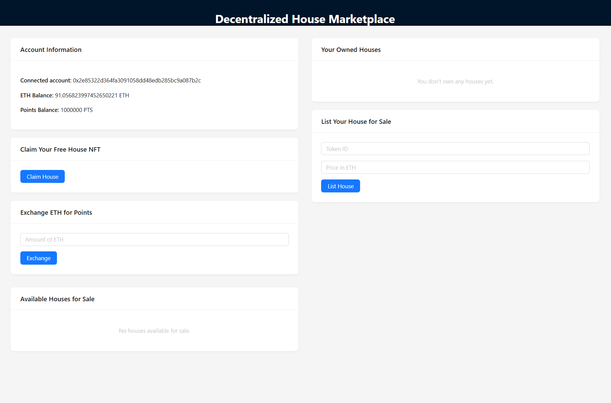
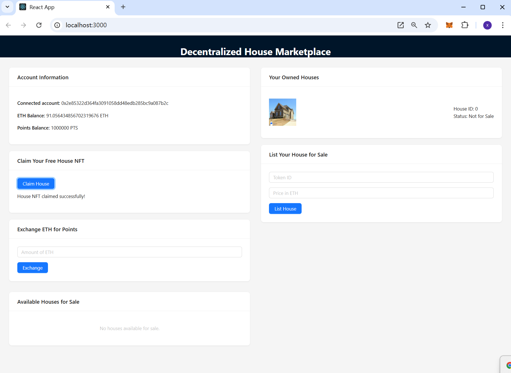
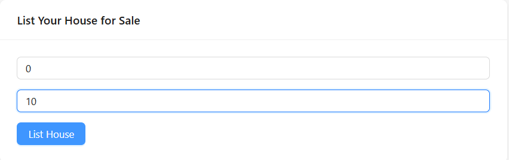
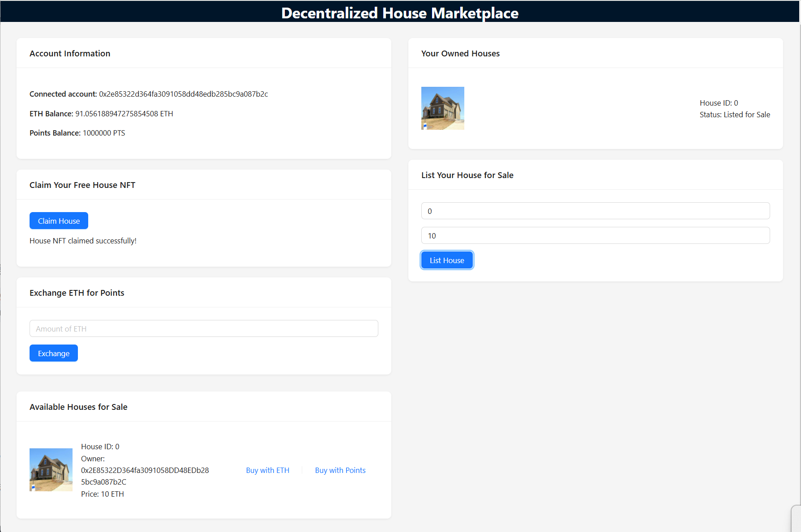
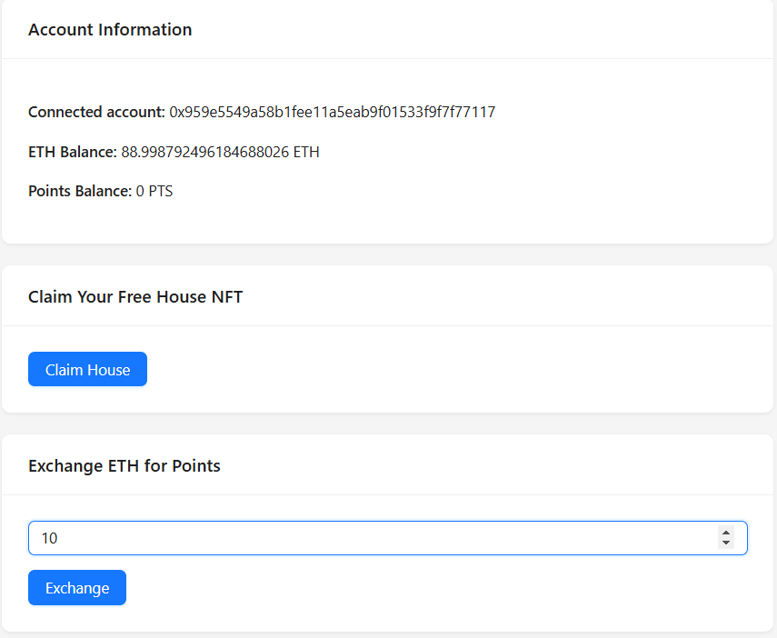
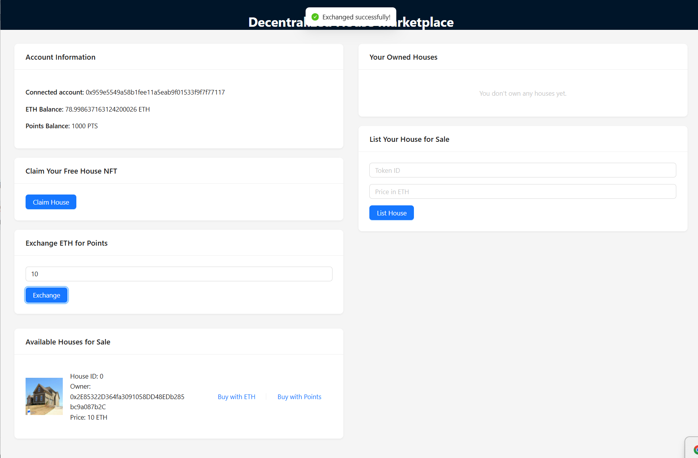
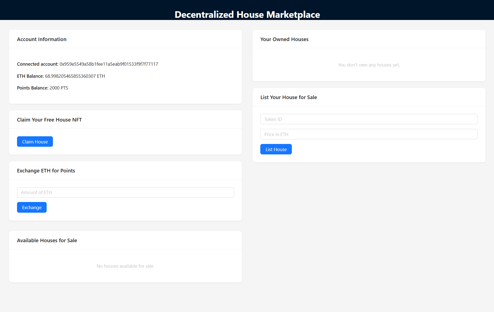
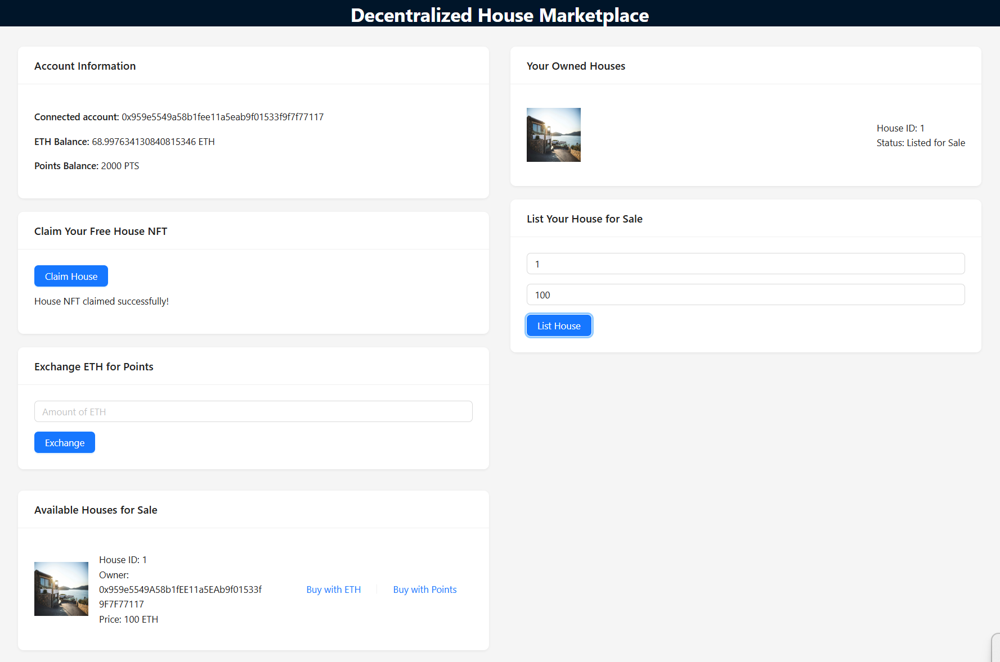
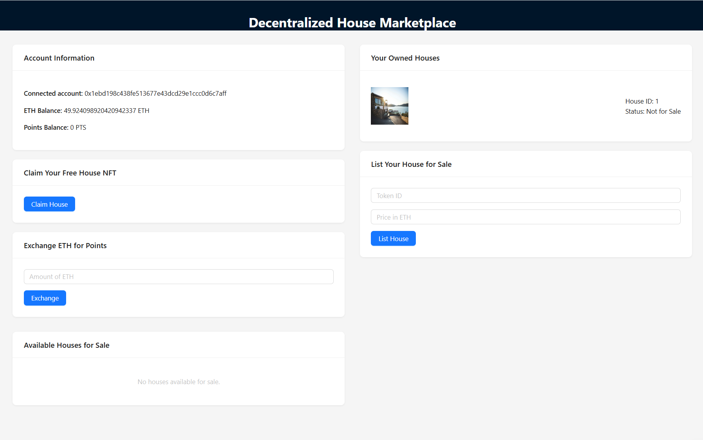
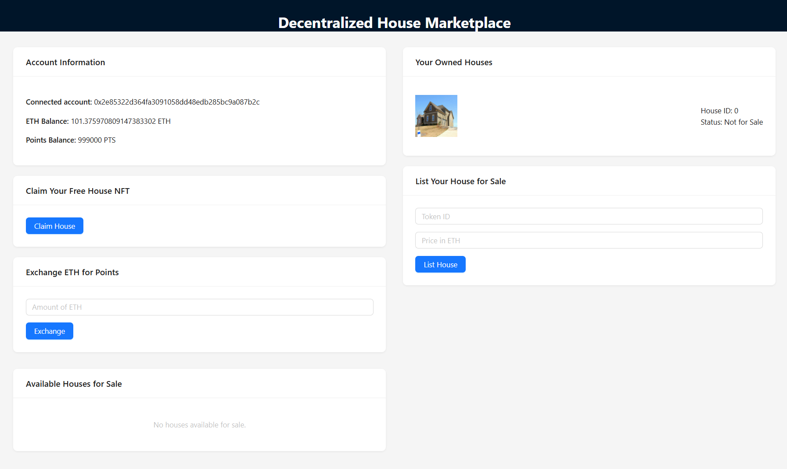

# ZJU-blockchain-course-2024

## 项目介绍

去中心化房屋购买系统，参与方包括：房屋拥有者，有购买房屋需求的用户

建立一个简易的房屋出售系统，在网站中：

- 创建一个（ERC721）合约，在合约中发行房屋集合，每个NFT代表一栋房屋。让部分用户免费领取部分房屋NFT，用于后面的测试。在本项目中，每个用户可以免费申请一个房屋
- 在网站中，用户可以出售，或者使用测试以太币购买房屋。每个用户可以： 
    1. 用户查看自己拥有的房产列表。并可以挂单出售自己的房屋（挂单包含价格等信息）。
    2. 用户查看所有出售中的房产，并查询一栋房产的主人，及各种挂单信息。
    3. 用户选择支付房屋价格对应的测试以太币，购买某个其他用户出售的房产。购买后房产拥有权应当发生变化。
    4. 平台收取手续费：在一个房产出售完成时，用户支付的部分测试以太币（=某栋房产在平台上的挂单时长（timestamp）* 固定比例 * 房产价格）应该被转入某个特定账户（如合约部署者），在本项目中，feeRate 为 1，以太币默认转入 ganache 第一个账户。

- 发行一个（ERC20）合约，允许用户将测试以太币兑换成ERC20积分，并使用ERC20积分完成购买房屋的流程。在本项目中，兑换比例为 1 ETH = 100 PTS.
- 简便起见，我找了十张图片当作房产，因为默认用户数量为 10 且每个用户只能申请一个房屋，若房屋数量大于十则多余的用 default.png 替代。


## 如何运行

### 合约部分

1. 在本地启动 ganache 应用。

2. 修改 `hardhat.config.ts` 中的配置，填入正确的 `url` 和账号私钥。

3. 在 `./contracts` 中安装需要的依赖，运行如下的命令：

   ```bash
   npm install
   ```

4. 在 `./contracts` 中编译合约，运行如下的命令：

   ```bash
   npx hardhat compile
   ```

5. 成功编译后，在`./contracts/hardhat.config.ts`文件中输入：

   ```
   npx hardhat run .\scripts\deploy.ts --network ganache
   ```

   将获得链的地址（两个），并将其填入`./frontend/src/utils/contract-addresses.json`

6. 将 `./contracts/artifacts/contracts/BuyMyRoom.sol/BuyMyRoom.json` 和 `./contracts/artifacts/contracts/RewardToken.sol/RewardToken.json` 中的内容复制粘贴于`./frontend/src/utils/abis/BuyMyRoom.json` 和 `./frontend/src/utils/abis/RewardToken.json` 中

### 前端部分

1. 在 `./frontend` 中安装需要的依赖，运行如下的命令：

   ```bash
   npm install
   ```

2. 在 `./frontend` 中启动前端程序，运行如下的命令：

   ```bash
   npm start
   ```

3. 记得在运行之前在 MetaMask 中导入好账号


## 功能实现分析

本项目完成了所有的功能以及 bonus，如下：

### 合约部分

#### 简介

1. `BuyMyRoom` 是一个基于 ERC721 标准的房屋交易合约，允许用户使用 ETH 或积分（ERC20 代币）来购买房产 NFT。用户可以挂牌出售房产、通过积分兑换以及领取免费房屋。合约还实现了手续费机制。
2. `RewardToken` 是一个基于 ERC20 标准的可增发和销毁的积分代币合约，代币名称为 "RewardToken" (符号：`RTK`)。管理员可以铸造新的代币或销毁代币，用于在其他合约中实现积分兑换和消费功能。


#### 状态变量

- **`rewardToken`** (`RewardToken`)：用于存储积分合约的实例，支持积分兑换与支付功能。
- **`rate`** (`uint256`)：积分兑换比例，1 ETH = `rate` 积分（默认值为 100）。
- **`houses`** (`mapping(uint256 => House)`)：存储每个房产的信息，包括所有者、价格、挂牌时间等。
- **`houseCount`** (`uint256`)：当前合约已创建的房屋数量。
- **`feeRate`** (`uint256`)：交易的手续费比例。
- **`maxSupply`** (`uint256`)：房产 NFT 的最大供应量（默认值为 100）。
- **`claimed`** (`mapping(address => bool)`)：记录用户是否已领取免费房屋。


#### 主要数据结构

**House**：包含每个房屋的详细信息：

```solidity
struct House {
    address owner;
    uint256 price;
    uint256 listedTimestamp;
    bool forSale;
}
```

- `owner` (`address`)：房屋当前所有者。
- `price` (`uint256`)：房屋挂牌价格。
- `listedTimestamp` (`uint256`)：挂牌的时间戳。
- `forSale` (`bool`)：房屋是否在挂牌中。


#### 事件

```solidity
event HouseListed(uint256 tokenId, uint256 price, address owner);
event HousePurchased(uint256 tokenId, address newOwner, uint256 price);
event HouseClaimed(uint256 tokenId, address owner);
```

- **`HouseListed`**：房屋被挂牌出售。
- **`HousePurchased`**：房屋成功交易。
- **`HouseClaimed`**：用户领取免费房屋。


#### 函数

##### 构造函数

```solidity
constructor(uint256 _feeRate, address _rewardToken) ERC721("BuyMyRoom", "BMR") Ownable(msg.sender) {
    feeRate = _feeRate;
    rewardToken = RewardToken(_rewardToken);
}
```

初始化 `BuyMyRoom` 合约，设置手续费比例和积分合约地址。

- `_feeRate`：交易的手续费比例。
- `_rewardToken`：积分合约的地址。

##### exchangeEthToPoints

```solidity
function exchangeEthToPoints() external payable
```

允许用户使用 ETH 兑换积分。ETH 按比例转换为积分，并铸造给调用者。

##### buyHouseWithPoints

```solidity
function buyHouseWithPoints(uint256 tokenId, uint256 priceInPoints) external
```

用户使用积分购买房屋。买家燃烧积分，卖家获得等量的积分。

- `tokenId`：房屋的 NFT ID。
- `priceInPoints`：购买价格（积分数量）。

##### claimHouse

```solidity
function claimHouse() external
```

用户可以免费领取一套房产 NFT，但每个用户仅限领取一次。

##### listHouse

```solidity
function listHouse(uint256 tokenId, uint256 price) external
```

房屋所有者将房屋挂牌出售并设置出售价格。

- `tokenId`：房屋的 NFT ID。
- `price`：挂牌价格。

##### buyHouse

```solidity
function buyHouse(uint256 tokenId) external payable
```

用户用 ETH 购买房屋。买家支付房屋价格，合约扣除手续费后将剩余金额转给卖家。

- `tokenId`：房屋的 NFT ID。

##### getOwnedHouses

```solidity
function getOwnedHouses(address user) external view returns (uint256[] memory)
```

返回指定用户拥有的房屋 ID 列表。

- `user`：查询的用户地址。

##### getAllListedHouses

```solidity
function getAllListedHouses() external view returns (uint256[] memory)
```

返回当前挂牌出售的所有房屋 ID 列表。

##### RewardToken.sol 中的函数

```solidity
constructor() ERC20("RewardToken", "RTK") Ownable(msg.sender)
function mint(address to, uint256 amount) external
function burn(address from, uint256 amount) external
```

- `mint` 函数用于铸造新的代币，用于根据业务需求为指定地址分配积分或奖励。

- `burn` 函数用于销毁代币，用于减少用户的代币余额，例如在积分消费、扣款、或清算等场景中。

继承自 OpenZeppelin 的 ERC20 合约，`RewardToken` 还具备以下核心功能：

1. **`transfer`**：用于在地址间直接转移代币。
   - **`transfer(address recipient, uint256 amount)`**：从调用者地址向 `recipient` 地址转移 `amount` 数量的代币。
2. **`balanceOf`**：查询指定地址的代币余额。
   - **`balanceOf(address account)`**：返回 `account` 地址当前持有的代币数量。
3. **`approve` 和 `transferFrom`**：授权和代理转账机制，用户可授权第三方（如合约）代为转账。
   - **`approve(address spender, uint256 amount)`**：授权 `spender` 可以使用调用者账户中的 `amount` 数量代币。
   - **`transferFrom(address sender, address recipient, uint256 amount)`**：在 `sender` 账户已授权的情况下，将 `amount` 数量的代币从 `sender` 转移至 `recipient`。


### 前端部分

​		基于 React 的前端界面，用于与智能合约交互，实现房产 NFT 的去中心化市场。用户可以在页面中查看和管理其账户信息、房产列表，进行积分兑换、房产购买、挂牌出售等操作。前端使用 `web3.js` 与智能合约进行交互，合约方法调用后会自动更新显示内容。


#### 主要功能

1. **账户信息展示**：显示连接账户的地址、ETH 余额和积分余额。
2. **房产管理**：用户可以领取免费房产 NFT、挂牌房产出售、使用 ETH 或积分购买房产。
3. **积分兑换**：用户可以将 ETH 兑换为积分，用于购买房产 NFT。


#### 代码结构

##### 1. **状态管理和初始化**

主要使用 `useState` 和 `useEffect` 进行数据状态管理和初始化。关键状态有：

   - `account`：用户连接的账户地址。
   - `balance`：用户的 ETH 余额。
   - `pointsBalance`：用户的积分余额。
   - `houses` 和 `ownedHouses`：当前市场上挂牌的房产和用户拥有的房产。
   - `claimStatus` 和 `isClaiming`：控制领取房产按钮的状态和提示信息。

在 `useEffect` 中调用 `loadBlockchainData()`，初始化页面数据，并在每次操作后刷新界面数据。


##### 2. **`loadBlockchainData` 函数**

负责加载并展示用户的账户数据，包括账户地址、ETH 余额、积分余额、用户拥有的房产列表和当前挂牌的房产列表。

   ```javascript
const loadBlockchainData = async () => { ... }
   ```

   - 获取用户的账户地址，并设置 `account` 状态。
   - 通过调用 `RewardTokenContract` 合约中的 `balanceOf` 获取用户的积分余额。
   - 使用合约方法 `getOwnedHouses` 和 `getAllListedHouses` 来分别加载用户拥有的房产和市场挂牌的房产，并在页面中展示。


##### 3. **`exchangeEthToPoints` 函数**

将用户输入的 ETH 数量转换为积分。使用 `BuyMyRoomContract` 中的 `exchangeEthToPoints` 方法进行兑换。

   ```javascript
const exchangeEthToPoints = async () => { ... }
   ```

   - 检查用户是否连接钱包并已输入 ETH 数量。
   - 调用合约方法并传递 `ETH` 金额。
   - 调用成功后，刷新数据并提示兑换成功。


##### 4. **`claimHouse` 函数**

用户点击按钮领取免费房产 NFT，领取后不能重复领取。调用 `BuyMyRoomContract` 中的 `claimHouse` 方法。

   ```javascript
const claimHouse = async () => { ... }
   ```

   - 检查是否已连接钱包。
   - 禁用按钮并提示领取状态。
   - 调用合约的 `claimHouse` 方法后，更新页面数据。


##### 5. **`listHouseForSale` 函数**

用户挂牌出售房产，需提供房产的 `Token ID` 和出售价格。调用 `BuyMyRoomContract` 中的 `listHouse` 方法。

   ```javascript
const listHouseForSale = async () => { ... }
   ```

   - 检查用户输入的 `Token ID` 和价格。
   - 将价格转换为 `wei` 后传递给合约方法。
   - 成功后刷新数据，并更新用户房产列表。


##### 6. **`buyHouse` 函数**

使用 ETH 购买房产。用户支付 ETH，调用 `BuyMyRoomContract` 中的 `buyHouse` 方法完成交易。

   ```javascript
const buyHouse = async (id: number, housePrice: string) => { ... }
   ```

   - 通过 `housePrice`（单位为 `wei`）指定价格，并将其作为 `msg.value` 发送。
   - 成功后刷新数据，并更新当前挂牌房产列表。


##### 7. **`buyHouseWithPoints` 函数**

用户可以使用积分购买房产，调用 `BuyMyRoomContract` 中的 `buyHouseWithPoints` 方法。通过 `BigInt` 将 `price` 转换为积分单位。

   ```javascript
const buyHouseWithPoints = async (id: number, price: string) => { ... }
   ```

   - 将价格转换为积分单位 `priceInPoints` 后传递给合约。
   - 调用成功后刷新页面数据。


#### 界面布局

使用 `antd` 组件库进行界面布局：

1. **`Account Information` 卡片**：显示用户的账户地址、ETH 余额和积分余额。
2. **`Claim Your Free House NFT` 卡片**：包含一个按钮，用于用户领取免费房产 NFT。
3. **`Exchange ETH for Points` 卡片**：提供 ETH 输入框和兑换按钮，允许用户用 ETH 兑换积分。
4. **`Your Owned Houses` 卡片**：显示用户当前拥有的房产列表。
5. **`List Your House for Sale` 卡片**：提供房产 ID 和价格输入框，用户可以在此挂牌出售房产。
6. **`Available Houses for Sale` 卡片**：展示市场上挂牌的房产列表。每个房产项包括“Buy with ETH”和“Buy with Points”按钮。


## 项目运行截图

#### 初始界面



#### 领取房屋



#### 挂起房屋





#### 兑换积分





#### 使用以太币购买

观察到以太币减少了


#### 使用积分购买

再次挂起这个房子，切换回第一个账号用积分购买，观察到积分减少了，同时可以看到之前第二个账号花费10以太币买的房子的以太币以及到账


切换到第二个账号，发现积分到账



#### 检测手续费功能

在第二个和第三个账号之间进行大额交易，观察第一个账号的以太币变化，发现收到了手续费：

1. 第二个账号挂起100块钱的房子：



2. 第三个账号购买：



3. 观察到第一个账号以太币增加：




## 参考内容

- 课程的参考Demo见：[DEMOs](https://github.com/LBruyne/blockchain-course-demos)。

- 快速实现 ERC721 和 ERC20：[模版](https://wizard.openzeppelin.com/#erc20)。记得安装相关依赖 ``"@openzeppelin/contracts": "^5.0.0"``。

- 如何实现ETH和ERC20的兑换？ [参考讲解](https://www.wtf.academy/en/docs/solidity-103/DEX/)
